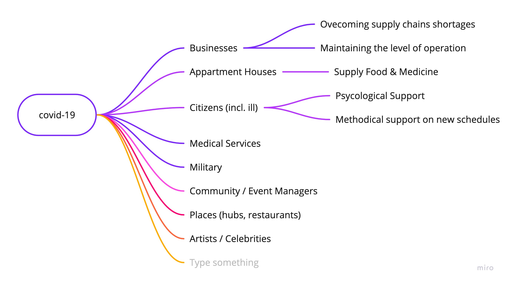

# Flattening the Curve \#stopcovid

Our task to flatten the curve of Coronavirus \(covid-19\):

Purpose: Collecting the knowledgebase on the fighting corona virus effects. 

#### What’s important to understand about what’s happening now?

* [This explainer video](https://www.youtube.com/watch?v=Kas0tIxDvrg) is an easy-to-understand 9-minute course on the fundamentals of epidemiology. **Key takeaway:** the number of recorded coronavirus cases outside mainland China is increasing by a factor of 10 every 16 days.
* After watching the above video, you’ll understand the logic of Yascha Mounk’s article in [The Atlantic, “Cancel Everything.”](https://www.theatlantic.com/ideas/archive/2020/03/coronavirus-cancel-everything/607675/) **Key takeaway:** “so far only one measure has been effective against the coronavirus: extreme social distancing.”
* [The Coronavirus Tech Handbook](https://coronavirustechhandbook.com/) is an open-sourced list of resources for citizen-scientists, makers, and others interested in learning how to help. **Key takeaway:** crowd-sourced activity around responses to COVID-19 is immense, and is an important source of informative signals to consider.


Want to write here – here're [the rights](https://app.gitbook.com/invite/dgov?invite=-M2JRBARwkcPd9AED8KT) \(pls be responsible\).


## **What are the consequences of the COVID-19 pandemic?**

* [Venture capitalist Azeem Azhar discusses six ways coronavirus will change our world](https://www.exponentialview.co/p/-six-ways-coronavirus-will-change). His list includes: open-sourcing formerly proprietary information about global threats, and a rise in online learning, working, and convening. **Key takeaway:** prepare for a shift from fragile global supply chains to “networked, decentralized and resilient” models.
* “Governments around the world may see this health crisis as an opportunity to introduce or implement controversial technology and systems for surveillance,” according to this [Access Now report](https://www.accessnow.org/protect-digital-rights-promote-public-health-towards-a-better-coronavirus-response/). **Key takeaway:** the outbreak is an opportunity “to assess how we can protect public health in the digital age, and where our digital rights fit into the global humanitarian response.”
* Building systems that are resilient to the global effects of pandemics could have far-reaching benefits. This 2010 paper published in the journal Influenza and [Other Respiratory Viruses](https://www.ncbi.nlm.nih.gov/pmc/articles/PMC4941659/) lists eight social benefits gained from developing effective response mechanisms to pandemics. **Key takeaway:** there are many “potential collateral benefits from pandemic planning and preparations that can be realized regardless of a future pandemic occurring.” ****

## Stakeholders & Actions

* [Anxiety and Psycological Support](psychological-support.md)
* [Food and medicine delivery](food-and-medicine-supply-chains.md)
* [Working online](moving-events-online.md)
* [Technology](tech.md)
* Flattening the curve
* Remote work
* Online education
* Vital services
* Analytics & Forecasting
* Pandemic Management
* Awareness Campaigns
* Capacity Building of Communities and Government Bodies
* Availability, Accessibility, & Affordability \(ie free\) of coronavirus testing kits
* Containment, changes to daily life, vulnerable populations
* Slow or no precautionary measures by governments, employers and organizations
* People around me still thinking it is a joke or a conspiracy
* community education on health, educational impact to current learners, effecting policy changes
* Workplace impact, employee safety, employee well-being , continuity , work adjustments
* breakdown of supply chains

## \*\*\*\*

## Working groups

* [\#Stopcovid Discord](https://discord.gg/rs8Jyg)
* [CoronaCuration](https://t.me/joinchat/KFwHIRhxdvdjrA9y2_EyUw) for people to post information and links
* [CoronaColab](https://t.me/joinchat/KFwHIRnRj6KrH6Q5D8hZkw): Get Shit Done

## Read more

**How can we better prepare ourselves for the next future shock?**

* [Ending Pandemics](https://endingpandemics.org/) is an organization dedicated to the early discovery of infectious disease outbreaks so they can be halted before they become pandemics. **Key takeaway:** “If we prioritize our efforts to find outbreaks faster in animals, it is possible to prevent human infection altogether.”
* In a world of uncertainty, only one thing is certain: shocks, disruptions, and other unsettling events will occur, and they will be novel and surprising. IFTF executive director Marina Gorbis argues in her essay [“The Future as a Way of Life,”](https://medium.com/@mgorbis/the-future-as-a-way-of-life-4bc314ec97de) that the only way to effectively deal with black swan events is through a “massively public endeavor” to envision and make the future. **Key takeaway:** “futures thinking is an essential 21st century skill: we need to cultivate it widely in everything we do.”
* Now, more than ever, it’s time to unstick your mind. “To avoid being blindsided by the future, you must develop mental habits of actively challenging what you believe could or could not be different,” writes IFTF’s Jane McGonigal in her essay, [“Counterfactual Thinking Is the Key to Creativity — and a Vaccine against Future Shock.”](https://medium.com/institute-for-the-future/counterfactual-thinking-is-the-key-to-creativity-and-a-vaccine-against-future-shock-9774a111b996) **Key takeaway:** “to invent something new, or make any kind of change in your society, you first have to be able to imagine how things can be different.”

## Articles

* [Coronavirus: seven ways collective intelligence is tackling the pandemic](https://theconversation.com/coronavirus-seven-ways-collective-intelligence-is-tackling-the-pandemic-133553)
* [I need you to read this and decide about Coronavirus Approaching the pandemic with a systems-thinking lens](https://medium.com/@phoebetickell/i-need-you-to-read-this-and-decide-about-coronavirus-6dd184745b33)
* [The Coronavirus is the Future Shock of the Decade: Three Things You Need To Know](https://mailchi.mp/iftf/news-from-the-future-issue-1478053?e=76e445d5a7)
* \*\*\*\*[Coronavirus — The Black Swan of 2020](https://angel.co/re/story/13514)
* [Coronavirus Tech Playbook](https://coronavirustechhandbook.com/)
* [Library](https://coronavirustechhandbook.com/communities)

